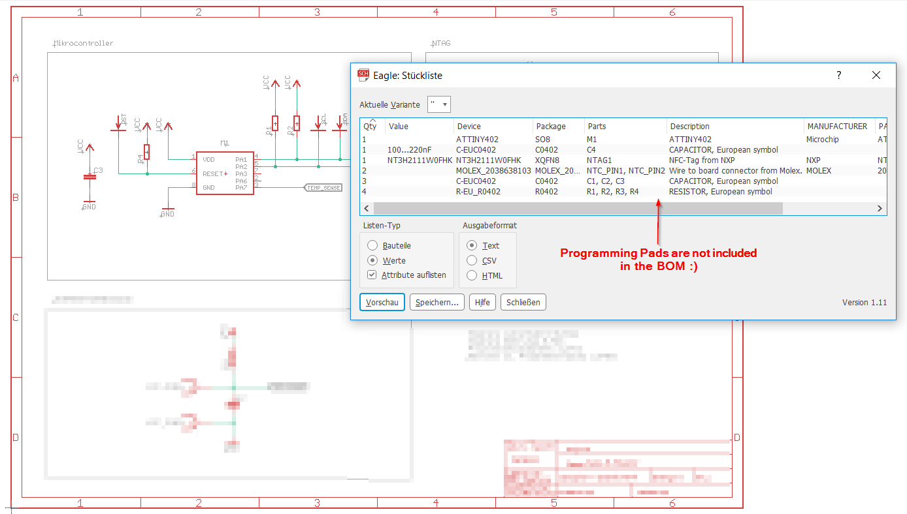
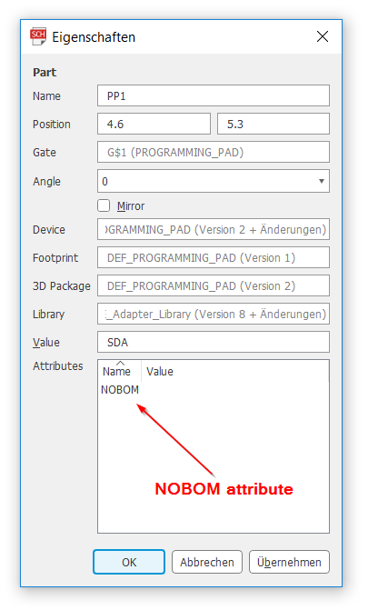

# BOM.ulp
 I use this ULP to create a bill of materials (=BOM) for my PCBs. :bookmark_tabs:

 

## Why I created this ULP
After installation EAGLE provides you an ULP called `bom.ulp`. Sometimes you'll
have components that shouldn't be in the BOM, like programming pads, NFC antennas
or unused components. Unfortunately the provided `bom.ulp` doesn't provide an
efficient way to skip this components.

## What is a BOM?
You can think of it as a kind of shopping list for your electronic design.
It contains all of the ingredients (parts) that go into making your PCB design
complete. But rather than just a general shopping list with a one-word value
for an item, an item in a BOM contains a ton of information that makes it
easy to identify, shop for, and purchase.

## How did I do that?
I made a copy of the `bom.ulp` file from the EAGLE 9.3.0 installation directory and
made some minor changes. The new ULP skips components that have an `NOBOM`
attribute (The value doesn't matter). Please also note that I had to change only
10-15 lines of code to do that.

## Usage
You can use the new ULP exactly the same way as the original `bom.ulp`.
Additionally you can add an attribute called `NOBOM` to the component, if you
don't want the component to appear in the BOM.

 

## Contribution
In case you found some bugs, please let me know! Pull requests are always appreciated! 

Have fun routing! :raised_hands:
